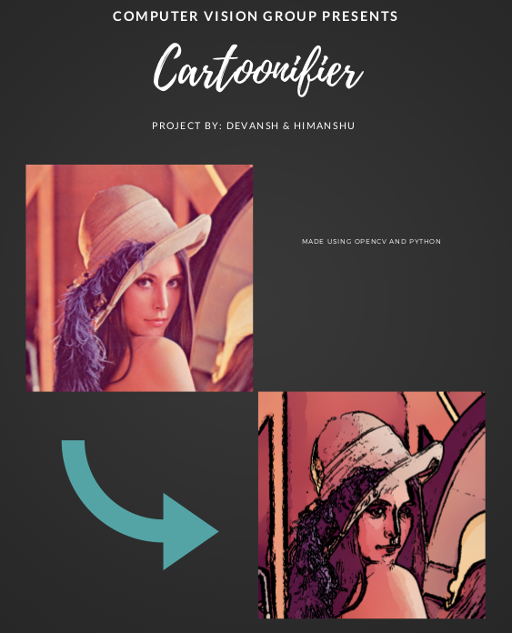

# Cartoonifier
Cartoonifier program involving techniques of OpenCV and image processing, built using Python programming language. 

[]

## Methods/Techniques used:
> Sobel edge detection
> Laplacian Filter
> Bilateral Filter

## Credits:
> Kaushal Kishore (Mentor) [CSE(B.Tech) - IIT Palakkad] 
> Devansh Singh Rathore [CSE(B.Tech) - IIT Palakkad] 
> Himanshu Jain [CSE(B.Tech) - IIT Palakkad] 
